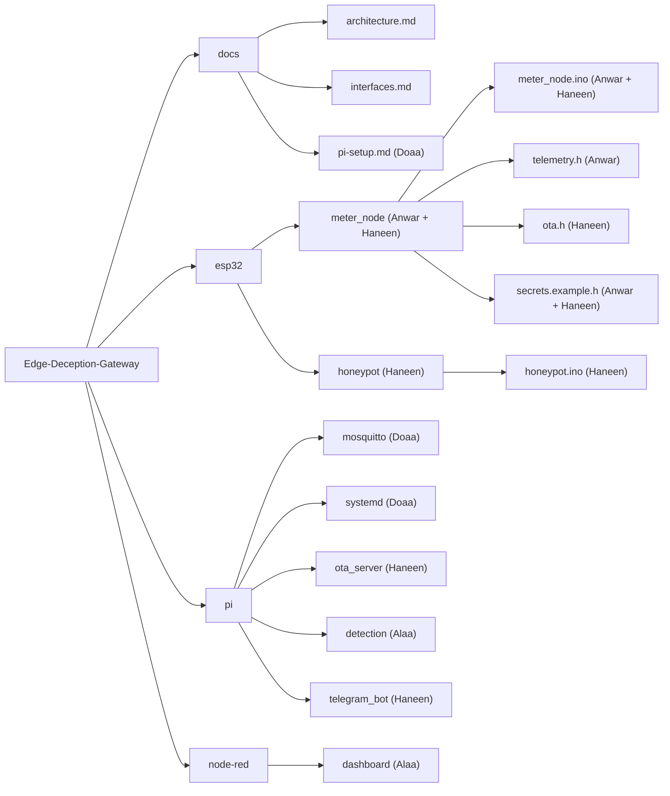

# Edge-Deception-Gateway
Edge-powered IIoT security gateway: detects DDoS on ESP32 smart meters using a Raspberry Pi, then switches the node to a honeypot via OTA, with Telegram alerts.

```mermaid
flowchart LR
  R["Edge-Deception-Gateway"] --> D["docs"]
  R --> E["esp32"]
  R --> P["pi"]
  R --> N["node-red"]

  D --> D1["architecture.md"]
  D --> D2["interfaces.md"]
  D --> D3["pi-setup.md (Doaa)"]

  E --> E1["meter_node (Anwar + Haneen)"]
  E --> E2["honeypot (Haneen)"]
  E1 --> E1a["meter_node.ino (Anwar + Haneen)"]
  E1 --> E1b["telemetry.h (Anwar)"]
  E1 --> E1c["ota.h (Haneen)"]
  E1 --> E1d["secrets.example.h (Anwar + Haneen)"]
  E2 --> E2a["honeypot.ino (Haneen)"]

  P --> P1["mosquitto (Doaa)"]
  P --> P2["systemd (Doaa)"]
  P --> P3["ota_server (Haneen)"]
  P --> P4["detection (Alaa)"]
  P --> P5["telegram_bot (Haneen)"]

  N --> N1["dashboard (Alaa)"]
```
