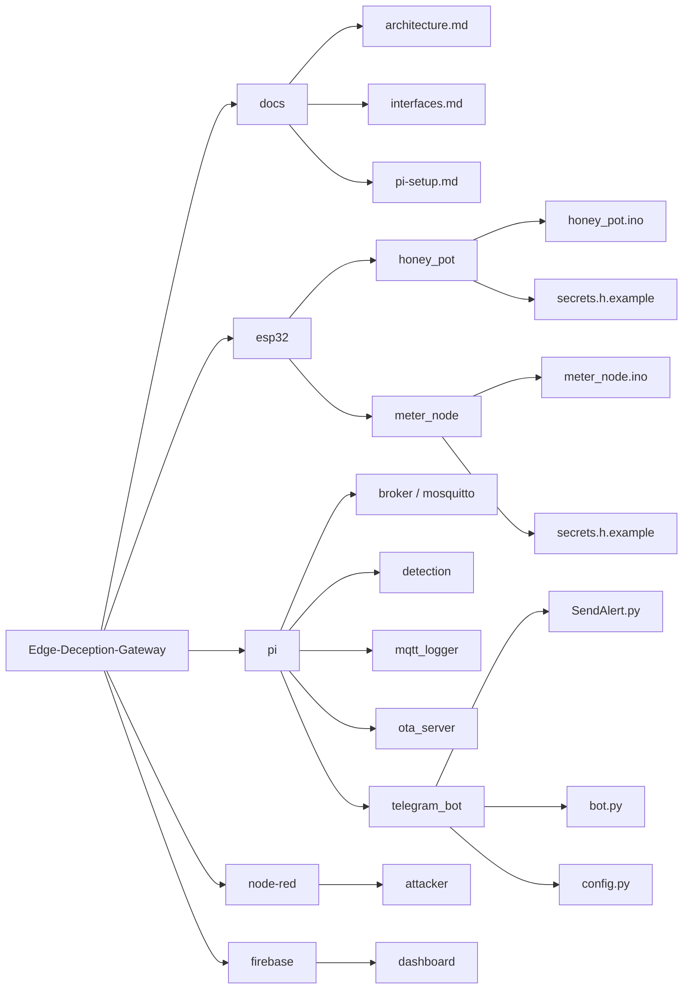

```mermaid
flowchart LR
  R["Edge-Deception-Gateway"] --> D["docs"]
  R --> E["esp32"]
  R --> P["pi"]
  R --> N["node-red"]
  R --> F["firebase"]

  D --> D1["architecture.md"]
  D --> D2["interfaces.md"]
  D --> D3["pi-setup.md"]

  E --> E1["honey_pot"]
  E --> E2["meter_node"]
  E1 --> E1a["honey_pot.ino"]
  E1 --> E1b["secrets.h.example"]
  E2 --> E2a["meter_node.ino"]
  E2 --> E2b["secrets.h.example"]

  P --> P1["broker / mosquitto"]
  P --> P2["detection"]
  P --> P3["mqtt_logger"]
  P --> P4["ota_server"]
  P --> P5["telegram_bot"]

  P5 --> P5a["SendAlert.py"]
  P5 --> P5b["bot.py"]
  P5 --> P5c["config.py"]

  N --> N1["attacker"]
  F --> F1["dashboard"]
```
